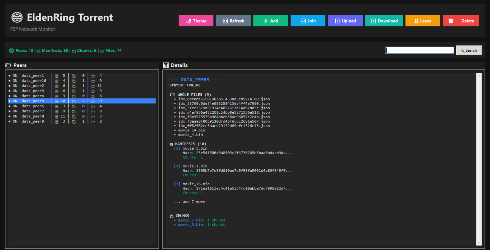
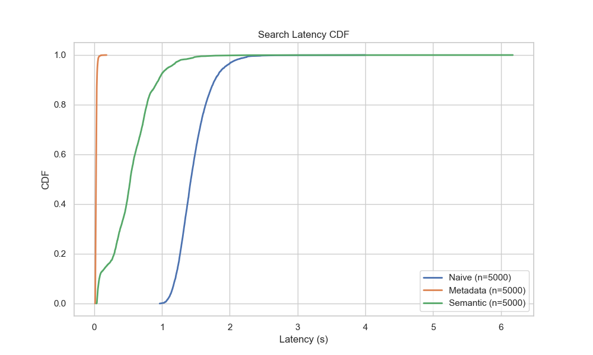
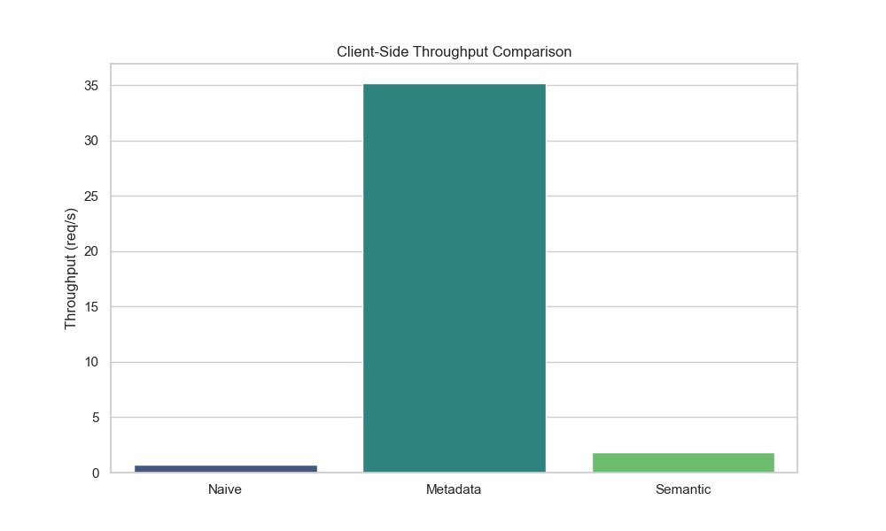
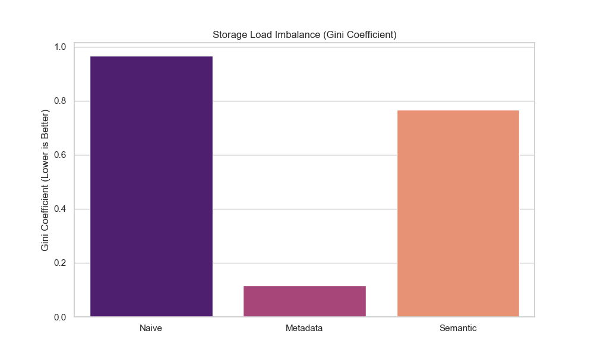

# EldenRingTorrent - Distributed Peer-to-Peer File Sharing System

  

EldenRingTorrent is a scalable, distributed Peer-to-Peer (P2P) file sharing system developed to evaluate and compare differing search and retrieval architectures within distributed networks. This project investigates the trade-offs regarding query latency, network overhead, and load balancing across unstructured and structured network topologies.

For a detailed analysis of the theoretical framework and experimental findings, please refer to the **[Project Report](report_bigdata_project.pdf)** and **[Presentation Slides](slides_bigdata_project.pdf)**.

## Architecture Guidelines

The system implements four distinct operational modes to facilitate comprehensive benchmarking and performance analysis:

### 1. Naive (Flooding)
Based on the Gnutella protocol, this mode utilizes an unstructured network topology. Search queries are propagated to neighboring nodes via a flooding mechanism with a defined Time-To-Live (TTL). While technically robust against node failures, this approach typically incurs high network overhead due to redundant message passing.

### 2. Metadata (Structured/Indexed)
This mode employs a Global Secondary Index (GSI) combined with a **Salting** strategy. High-frequency keys (e.g., popular content search terms) are distributed across multiple nodes to effectively mitigate hotspotting and ensure equitable load distribution during search operations.

### 3. Semantic (Data Locality)
The Semantic mode implements a **Document Partitioning** strategy. Files are distributed based on semantic attributes (e.g., "Genre"), ensuring that related content resides on the same node or its replicas. This enables O(1) routing for attribute-based queries, significantly reducing search latency for targeted lookups.

### 4. P4P (Network Awareness)
The P4P mode integrates **ALTO (Application-Layer Traffic Optimization)** protocols. Nodes interact with an iTracker to obtain network cost maps and endpoint costs. Peer selection for transfers is optimized by combining logical distance with physical network metrics (RTT and ISP costs), thereby minimizing cross-ISP traffic and improving download speeds.

## Graphical User Interface (GUI)

The application includes a specialized GUI for real-time visualization of peer states, file holdings, and network interactions.



The interface allows users to:
*   Monitor connected peers and their status.
*   Inspect distributed file manifests and local storage.
*   Execute manual search queries and file uploads.
*   Visualize network traffic and query propagation in real-time.

## Project Structure

The repository is organized as follows:

```text
/
├── peer/                   # Core P2P Node Logic
│   ├── api.py              # Flask REST API for inter-node communication
│   ├── storage.py          # Local storage and index management
│   ├── naive.py            # Implementation of Flooding logic
│   ├── metadata.py         # Implementation of GSI & Salting logic
│   ├── semantic.py         # Implementation of Document Partitioning logic
│   └── peerp4p.py          # Implementation of ALTO/P4P Network Awareness
├── benchmark_scripts/      # Benchmarking and Testing Tools
│   ├── benchmark_suite.py  # Main orchestrator (Upload, Search, Metrics)
│   └── benchmark_plotter.py# Data visualization and plot generation
├── utils/                  # Deployment & Helper Scripts
│   ├── startup-hybrid.sh   # Setup script for Hybrid/Cloud environments
│   └── script_cloud.ps1    # PowerShell utilities
├── plots/                  # Generated Performance Visualizations
└── docker-compose.yml      # Container orchestration configuration
```

## Getting Started

### Prerequisites
*   **Docker** & **Docker Compose**
*   **Python 3.10+** (Required for executing local benchmark scripts)

### Installation

1.  Clone the repository:
    ```bash
    git clone https://github.com/fefe202/elden-ring-torrent.git
    cd elden-ring-torrent
    ```

### System Execution

The simulation cluster is managed via Docker Compose. The default configuration initializes a network of 10 peers.

### Quick Demo

For a plug-and-play demonstration of the system (including environment setup, file upload/search/download, and GUI launch), simply run:

```bash
python demo.py
```

This script will:
1.  Check Docker requirements.
2.  Start the P2P cluster in your chosen mode (Naive, Metadata, Semantic).
3.  Simulate a workflow.
4.  Optionally launch the GUI.

### Manual Execution

**Start in Naive Mode (Default)**
```bash
docker-compose up --build
```

**Start in Metadata Mode**
```bash
PEER_MODE=METADATA docker-compose up --build
```

**Start in Semantic Mode**
```bash
PEER_MODE=SEMANTIC docker-compose up --build
```

**Start in P4P Mode**
```bash
PEER_MODE=P4P docker-compose up --build
```

## Benchmarking

A comprehensive benchmark suite is provided to stress-test the system under various conditions. The benchmark suite simulates the following phases:

1.  **Upload Phase**: Distributed file upload simulating a Zipfian distribution for content popularity.
2.  **Search Phase**: Execution of mixed query workloads including Hotspot queries, Rare item searches, and Multi-attribute filtering.
3.  **Metrics Collection**: Aggregation of Latency, Throughput, Load Variance, and Gini Coefficient data.

### Running the Benchmark Suite

Execute the main benchmark orchestrator. Ensure the Docker cluster is running or configure the script to manage the lifecycle.

```bash
python benchmark_scripts/benchmark_suite.py
```
*Results will be serialized and saved to `benchmark_results.json`.*

### High-Load Testing

For performance testing in high-resource environments (e.g., Cloud VMs):

```bash
python benchmark_scripts/benchmark_cloud_heavy.py
```

### Data Visualization

To generate performance plots from the collected benchmark data:

```bash
python benchmark_scripts/benchmark_plotter.py
```
Output images will be stored in the `plots/` directory.

## Performance Results

The following visualizations illustrate key performance metrics observed during testing.

### Latency Analysis
The Cumulative Distribution Function (CDF) of search latency across varying load conditions. Steeper curves indicate more consistent performance and lower jitter.



### Throughput and Saturation
Analysis of system throughput (requests per second) under increasing query rates, demonstrating the saturation points of different architectures.



### Load Balancing (Gini Coefficient)
The Gini Coefficient measures the inequality of load distribution among peers (0 represents perfect equality, 1 represents maximal inequality). The Metadata strategy significantly improves load balancing compared to standard indexing.



## Utilities

*   `utils/startup-hybrid.sh`: Automates environment setup on fresh Linux VMs, including Docker installation and repository cloning.
*   `utils/generate_compose.py`: Generates `docker-compose.yml` configurations for large-scale clusters (e.g., 50+ nodes).

## Authors

*   **JFede**